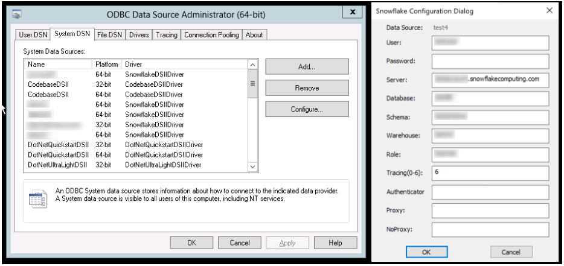

# Snowflake VBA 연동 및 데이터 조회 

### 1. Snowflake ODBC 설치 및 설정 

#### 1-1. Snowflake ODBC 설치

- 링크 : https://developers.snowflake.com/odbc/ 

#### 1-2. Snowflake ODBC 설정 및 DSN 생성

- 참고 자료 : https://docs.snowflake.com/en/developer-guide/odbc/odbc-window 

  ##### 1-2-1. window 검색 창에 "ODBC Data Sources (64-bit)" 검색 후 접속

  - 설정 창에서 드라이버 탭으로 이동 후 "Snowflake DSIIDriver" 있는지 확인

  

  ##### 1-2-2. DSN 생성

  - "System DSN" 탭으로 이동 후 "추가" 클릭(SnowflakeDSIIDriver 선택 후 마침)
  - Snowflake 계정 정보 입력 후 "Test" 진행.

  

#### 1-3. VBA 동작 확인

- 동작 확인은 "DX유니콘 ver.2.1.7.7.xlsm" 파일의 “style_custom” 시트" 에서 진행함.

##### 1-3-1. VBA 실행하기 

- "DX유니콘 ver.2.1.7.7.xlsm" 파일 실행 후 "Alt + F11"로 VBA를 실행한다.
- "style_custom"의 "데이터 불러오기" 버튼 클릭 후 "디버그" 클릭


- 코드 상단에 DSN Connection 정보 변경하기

  - ```
    RDS.ActiveConnection = "DSN=DSN명;Username=Snowflake계정명;Password=Snowflake비밀번호;"
    ```


- 밑 하단의 쿼리에서 "unicorn.temp_prdt_val" 테이블이 누락되어 임시로 주석처리함.

  - ```
    strSQL = strSQL & vbCrLf & " select distinct"
    strSQL = strSQL & vbCrLf & "        a.brd_cd"
    strSQL = strSQL & vbCrLf & "        ,a.sesn"
    strSQL = strSQL & vbCrLf & "        ,a.part_cd"
    strSQL = strSQL & vbCrLf & " from prcs.db_prdt_sc a"
    strSQL = strSQL & vbCrLf & " where 1 = 1"
    strSQL = strSQL & vbCrLf & "   and a.brd_cd = 'A'"
    strSQL = strSQL & vbCrLf & "   and a.sesn = '22S'"
    ```


- 다시 "style_custom"의 "데이터 불러오기" 버튼 클릭 후 데이터를 확인한다.

