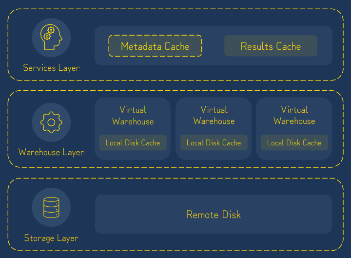
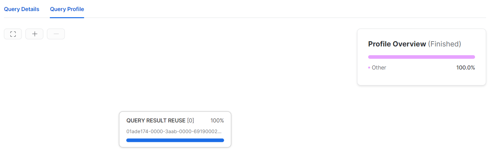
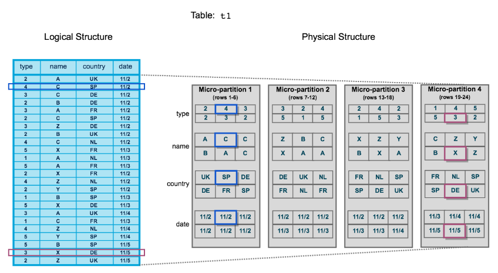

# Caching in Snowflake Data Warehouse

### 1. Snowflake Caching Overview

- Snowflake의 Architecture가 쿼리 속도를 높이기 위해 다양한 캐싱 유형을 사용한다. 이 캐싱 방식에 대해 이해하고 사용하여 시스템 성능을 극대화하는 방법을 알려고 한다.
  - **Caching** : 더 빠른 접근을 위해 자주 접근하는 데이터를 메모리나 디스크와 같은 임시 위치에 저장하는 프로세스

#### 1-1. Snowflake Architecture에서 사용하는 Cache 정보

- Snowflake Architecture 는 3개의 Layer로 나눠져 있음.
  - 

##### 1-1-1. Services Layer

- 사용자의 SQL Query 요청을 받아들이고, 트랜잭션 및 **Query의 결과**를 관리(Result Cache)함. 실행했던 모든 Query의 결과를 **Result Cache**에 보관함.
- Service Layer는 다양한 클라이언트에서 Query를 요청받고, 사용자와 DB간의 인증 및 권한 부여, 메타 데이터 관리등의 작업을 수행함. 또한, Query 실행 계획을 최적화하고 Query를 Warehouse Layer로 보내 실행함.

##### 1-1-2. Warehouse Layer (Compute Layer)

- Query의 처리를 담당하는 계산 리소스(Warehouse)를 관리하는 계층으로 Services Layer로 부터 Compute Layer로 전송되면, Compute Layer에서는 적절한 리소스(Warehouse)를 할당하고 쿼리를 병렬로 실행하여 결과를 생성함. 필요에 따라 자동으로 확장하거나 축소하여 쿼리 성능을 최적화함.

  - **Warehouse Scaling up**

    - Query의 성능을 향상시킴.
    - ```sql
      -- 기존의 Warehouse의 size가 X-Small 인 경우 --
      -- X-Small -> LARGE 로 변경 하여 Query의 성능을 향상함.
      ALTER WAREHOUSE MY_WH 
      	SET WAREHOUSE_SIZE = LARGE;
      ```
  - **Warehouse Scaling Out & In**

    - 동시에 사용자/쿼리 수에 따라 Warehouse의 수를 늘리거나 축소함.
    - Snowflake Keyword : Multi-cluster Warehouses
- 실제 Query는 Virtual Warehouse에서 실행됨. 이 계층은 **쿼리된 데이터**가 Local Disk Cache에 저장됨. Warehouse Layer의 모든 데이터는 일시적이며, 가상 웨어하우스가 활성화 되어 있는 한에만 저장됨.

##### 1-1-3. Storage Layer

- 데이터를 저장하는 계층으로 Snowflake는 데이터를 Column Storage 형식으로 저장함. Columnar storage 형식은 데이터를 column별로 압축하여 저장하는 방식으로, 데이터 압축과 스토리지 성능을 최적화하여 데이터 읽기와 쓰기 작업에 효율적임.
- Snowflake는 클라우드 기반의 Storage 서비스(AWS ,Google, Azure)를 활용하므로 Storage를 유연하게 확장하고 용량을 조정할 수 있음.

#### 1-2. Services Layer 에서의 Cache

##### 1-2-1. Metadata Cache

- **DB, Schema, Table, View 등에 대한 메타 정보**를 메모리에 저장함. 사용자가 DB객체의 정보를 쿼리하면 Snowflake는 개체의 메타데이터가 이미 Meatadata Cache에 있는지 확인 후, 있으면 캐시된 메타데이터를 반환함.
- Meatadata Cache는 시간 종속성이 없으며 테이블 데이터가 변경되도 상관없지만 Schema 도는 개체에 대한 정의가 변경되면 캐시된 정보는 사라진다.
- **Query Ex**: Table 행 수, 테이블 크기, 컬럼의 최소 및 최대 값, 고유 값 수 및 NULL 수 등.

  - ```sql
    -- 예시 쿼리 --
    SELECT COUNT(*) FROM MY_TABLE;
    SELECT CURRENT_DATABASE();      -- 현재 사용중인 DB명 출력
    DESCRIBE TABLE MY_TABLE;		-- 특정 테이블 메타 데이터 출력
    SHOW TABLES;					-- 현재 사용중인 SCHEMA의 테이블 메타 데이터 출력 
    ```

##### 1-2-2. Results Cache

- 사용자가 쿼리를 실행하면 Snowflake는 쿼리 결과가 이미 Result Cache에 있는지 자동으로 확인 후, 있으면 쿼리를 다시 실행하는 대신 캐시된 결과를 반환함.
- 지난 24시간 동안 실행된 모든 쿼리의 결과를 보유함.
- Results Cache를 사용하기 위한 **조건** :

  - 새로운 쿼리는 기존의 실행했던 쿼리와 완전히 일치해야 함.
  - Base Table Data가 변경 되지 않아야 함.
  - 기존의 쿼리와 동일한 role이 사용되어야 함.
  - "CURRENT_TIME()"과 같은 시간 관련 함수는 Result Cache를 사용하지 않음.
- 장점 : 반복되는 쿼리는 빠르게 반환되고 compute credit을 사용하지 않음.
- 쿼리가 Result Cache를 사용했는지 확인하려면 쿼리의 Profile을 확인함.

  - 

#### 1-3. Warehouse Layer 에서의 Cache

##### 1-3-1. Local Disk Cache(Warehouse Cache)

- 이 Cache는 첫 번째 Query에서 사용된 Micro-partition을 저장하고 향후 다음 Query를 위해 Cache에 저장함. 다음 Query에서 동일한 Micro-partiton이 필요하면 Micro-partition이 저장된 Storage Layer에서 가져오지 않고 Cache에서 가져옴.

  - Micro-partition은 Snowflake의 기본적인 데이터 저장 형식.
  - 동일한 Micro-partiton 불러오기 때문에 같은 가상 웨어하우스를 쓰는 모든 User에게 적용됨.
  - Snowflake는 Table의 모든 데이터는 연속적인 스토리지 단위인 "Micro-partition"으로 분할됨. Table의 행 그룹은 개별 마이크로 파티션에 매핑되며, **컬럼 방식**으로 구성됨.
  - Snowflake는 Query를 실행할 때 필요한 Micro-partition만 읽어와서 처리함. => Query 성능 향상.
  - Micro-partiton 상세내용 : https://docs.snowflake.com/en/user-guide/tables-clustering-micropartitions
  - 
- 참고사항 :

  - 가상 웨어하우스의 크기가 조정되거나 일시 중단, 삭제 될 때 Cache도 삭제됨.
  - 가상 웨어하우스 크기가 클수록 Cache도 커짐.

#### 1-4. 결론

- Local Disk Cache는 특정 가상 웨어하우스 내에서의 Query 성능 최적화에 사용되고, Result & Metadata Cache는 일반적인 Query 성능 최적화에 사용됨. 각 Cache는 서로 다른 용도로 사용되며 Snowflake는 세 가지 유형의 Cache를 활용하여 쿼리 성능을 향상시키고 리소스 사용을 줄임.
