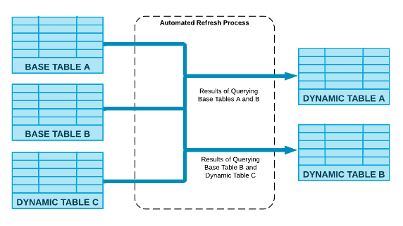
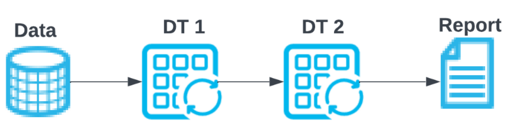

# 1. Snowflake Dynamic Table

- 참고 : https://docs.snowflake.com/en/user-guide/dynamic-tables-about

### 1-1. Dynamic Table Overview

- 선언적 데이터 변환 파이프라인의 구성요소로 사용할 데이터를 안정적이고 비용 효율적이며 자동화된 방식으로 변환할 수 있음.
- 데이터 변환 단계를 Snowflake의 Task로 정의하고 스케줄링을 모니터링해야 하는 대신 Dynamic Table을 사용하여 단순화할 수 있음.

### 1-2. Dynamic Table 정의

- Dynamic Table은 사용자가 지정한 쿼리의 결과를 구체화하는 Table임. 별도의 Target Table을 생성하고 해당 Table의 데이터를 변환 및 업데이트하는 코드를 작성하는 대신 Target 테이블을 Dynamic Table로 정의하고 변환을 수행하는 SQL문을 지정할 수 있음.
- 정기적인 업데이트를 통해 Dynamic Table의 데이터는 자동으로 업데이트 됨.
- 참고 및 주의사항
  - Dynamic Table은 지정된 쿼리에 의해 완전히 결정되므로 DML을 통해 Dynamic Table의 데이터 변경 불가(삽입, 업데이트 or 삭제) 못함.
  - Dynamic Table이 있는 Database는 Replicating이 불가함. 하려면 DB를 복제하기 전에 DB의 Dynamic Table을 삭제해야 함.

### 1-3. Dynamic Table Example

- 기존 stream & Task SQL과 비교 : https://docs.snowflake.com/en/user-guide/dynamic-tables-about#a-simple-example
- raw 테이블에 json 데이터가 들어올때 Dynamic Table은 **"TARGET_LAG"** 주기로 데이터 최신상태 유지.
- Stream & Task의 복잡성을 피할 수 있음. 

```sql
-- Create a landing table to store
-- raw JSON data.
CREATE OR REPLACE TABLE raw
(var VARIANT);

-- Create a dynamic table containing the
-- names of office visitors from
-- the raw data.
-- Try to keep the data up to date within
-- 1 minute of real time.
CREATE OR REPLACE DYNAMIC TABLE names
TARGET_LAG = '1 minute'
WAREHOUSE = mywh
AS
SELECT var:id::int id, var:fname::string first_name,
var:lname::string last_name FROM raw;
```

### 1-4. Dynamic Table 작동방식



- Dynamic Table을 만들때 TARGET LAG를 활용해 Base Table이 업데이트 된 후, TARGET LAG 값만큼 Dynamic Table 업데이트를 지연시킬 수 있음. 비용 절감을 위해서는 TARGET LAG 시간을 사용자에게 적절할 만큼만 늘려야 함.
- Dynamic Table 끼리 조합해서 또 다른 Dynamic Table 생성 가능.

### 1-5. Dynamic Table 관리하는데 필요한 Privileges

| Privilege          | Usage                                                        |
| :----------------- | :----------------------------------------------------------- |
| SELECT             | Dynamic Table의 SELECT 권한.                                 |
| OPERATE            | Dynamic table의 속성을 변경하는데 필요함 :<br /> - "ALTER ... SUSPEND" <br /> - "ALTER ... RESUME"<br /> - "ALTER ... REFRESH"<br /> - WAREHOUSE and TARGET_LAG |
| OWNERSHIP          | Dynamic Table에 대한 전체 제어 권한을 부여해야함.            |
| ALL [ PRIVILEGES ] | Grants all privileges, except OWNERSHIP, on the dynamic table. |

### 1-6. Dynamic Table Refresh Types

- Dynamic Table 에서 **Refresh** 의 의미 :
  - Dynamic Table을 생성할 때 정의된 쿼리에서 사용되는 Base 객체들의 데이터가 변경되면 이러한 변경사항을 반영하도록 Dynamic Table을 업데이트해야 하는데 이러한 업데이트를 **Refresh** 라고 함.

#### 1-6-1) **Incremental refresh**

- Dynamic Table 생성할 때의 쿼리를 분석하고, 쿼리 결과에 대한 변경사항(Dynamic Table이 마지막으로 새로 고침된 이후의 변경사항)을 계산하여, 이러한 변경사항을 기존의 Dynamic Table과 병합함.

#### 1-6-2) **Full refresh**

- Dynamic Table 생성할 때의 쿼리를 분석하고, 기존의 Dynamic Table의 모든 데이터를 완전히 대체함.

#### 1-6-3) 참고사항

- Dynamic Table을 생성한 후 테이블을 모니터링하여 해당 테이블을 업데이트 하는데 Incremental refresh 또는 Full refresh를 사용하는지 확인 가능.

  - ```sql
    -- Dynamic Table 을 생성한 후 밑의 쿼리를 실행한다. 
    -- 결과에서 refresh_mode를 확인한다.
    show dynamic tables;
    ```

- **Dynamic Table의 생성 쿼리를 기반**으로 Incremental refresh를 사용할 수 있는지 **여부를 결정**함. Incremental refresh를 지원하지 않은 쿼리 일때 Full refresh 방식으로 Dynamic Table을 업데이트 함. 

  - 참고(Incremental refesh 지원 쿼리) : https://docs.snowflake.com/en/user-guide/dynamic-tables-refresh#label-dynamic-tables-intro-refresh-queries 

### 1-7. Dynamic Table Lag 지정방법

#### 1-7-1. Measure of freshness

- TARGET_LAG = {`<num> {seconds| ... | days }`}
- 일반적으로 TARGET_LAG 주기 동안 Dynamic Table 업데이트

#### 1-7-2. DOWNSTREAM

- Dynamic Table에 종속된 다른 Dynamic Table을 새로 고쳐야 할 때 사용.
- Downstream Dynamic Table은 Upstream 소비자가 필요로 하는 경우에만 업데이트 됨.

#### 1-7-3. 동작 예시 

- | DT1                     | DT2                     | Refresh results                                              |
  | ----------------------- | ----------------------- | ------------------------------------------------------------ |
  | TARGET_LAG = DOWNSTREAM | TARGET_LAG= 10minutes   | DT2가 10분마다 업데이트 될 때, DT2가 업데이트를 요구할 때마다 DT1도 업데이트 됨. |
  | TARGET_LAG= 10minutes   | TARGET_LAG = DOWNSTREAM | 이 경우는 DT2를 소비하는 소비자가 정의될 때까지 DT2는 정기적으로 업데이트 되지 않음. DT1은 10분마다 업데이트. |
  | TARGET_LAG= 5minutes    | TARGET_LAG= 10minutes   | DT2는  5분마다 업데이트가 되는 DT1의 데이터로 DT2가 10분마다 업데이트 됨. |
  | TARGET_LAG = DOWNSTREAM | TARGET_LAG = DOWNSTREAM | DT2를 소비하는 소비자가 없어, DT2는 주기적으로 업데이트 되지 않음. |




### 1-8. Dynamic Table vs Streams & Tasks

- 참고 : https://docs.snowflake.com/en/user-guide/dynamic-tables-comparison

- | Streams and Tasks                                            | Dynamic Tables                                               |
  | :----------------------------------------------------------- | ------------------------------------------------------------ |
  | Task내에서 **사용할 수 있는 쿼리**는 non-deterministic code,Stored procedures, other tasks, UDF & External function 등에 대한 호출을 포함함. | Stored procedures and Tasks, UDF and External function 에 대한 호출 사용불가. Shared tables, External tables, MV, Dynamic table에 대한 View |
  | Task는 명령적 접근법을 사용. Base Table에서 데이터를 변환하기 위해 Stream과 같은 객체를 참조하고 조건에 맞는 절차 코드를 작성함. | Dynamic Table은 선언적 접근법을 사용. 보고 싶은 결과를 지정하는 쿼리를 작성하면 쿼리에 사용된 Base Table에서 데이터가 검색되고 변환됨. |
  
- non-deterministic code 목록 : https://docs.snowflake.com/en/user-guide/dynamic-tables-tasks-create#label-dynamic-tables-intro-supported-nondeterministic-functions

### 1-9. Dynamic Table vs MV

| MV                                                           | Dynamic Table                                                |
| ------------------------------------------------------------ | ------------------------------------------------------------ |
| 단일 base Table만 사용 가능. Base Table로 (join or 중첩된 View) 는 사용불가. | Base Table로 join 및 union을 포함할 수 있는 복잡한 쿼리를 사용가능. |
| 백그라운드로 업데이트 되기 때문에 항상 업데이트된 데이터를 MV로 조회할 수 있음. | Target lag 시간 마다 업데이트된 데이터를 Dynamic Table로 조회할 수 있음. |

### 1-10. Dynamic Table States

- 참고 : https://docs.snowflake.com/en/user-guide/dynamic-tables-states

- Dynamic Table의 scheduling state를 보려면 **DYNAMIC_TABLE_GRAPH_HISTORY** 테이블 호출 후 "**SCHELLING_STATE**" 컬럼을 확인한다.

### 1-11. Streams and Dynamic Tables

- Dynamic Table에 대한 stream 생성 가능.
  - Dynamic Table은 **Standard stream**만 지원함.


- Dynamic Table의 Refresh Type에 따라 stream 동작 방식이 다름.
  -  Incrementally일 경우 : 
    - Base Dynamic Table의 변경 내용을 기반으로 이벤트 집합을 발생 시킴.
  - Fully 방식일 경우 :
    - Dynamic Table 데이터 전체가 새로 고침되므로 stream에 모든 행에 대한 이벤트 행이 발생함.  

```sql
-- Create the dynamic table, for reference only
CREATE OR REPLACE DYNAMIC table dtBase
. . .  FROM baseTable;

-- Create the stream.
CREATE OR REPLACE STREAM deltaStream on DYNAMIC TABLE dtBase;
```

### 1-12. Working with Dynamic Tables

- 참고  : https://docs.snowflake.com/en/user-guide/dynamic-tables-tasks

#### 1-12-1. Creating Dynamic Tables

```sql
CREATE OR REPLACE DYNAMIC TABLE product
  TARGET_LAG = '20 minutes'
  WAREHOUSE = mywh	-- 사용할 웨어하우스 지정.
  AS
    SELECT product_id, product_name FROM staging_table;
```

- 참고사항 : Dynamic Table에서 사용하는 모든 개체의 change tracking이 활성화되어 있는지 확인 필요.
  - change tracking 활성화 유무 확인 명령어 => show views , show tables 등.
  - change tracking 활성화 하려면 alter table , alter view 명령어로 활성화 하기.

#### 1-12-2. Privileges Required to Create Dynamic Table

- Table을 생성하기 위한 DB와 스키마에 대한 **USAGE** 권한
- 테이블을 작성할 스키마에 **CREATE DYNAMIC TABLE** 권한
- 동적 테이블에 대해 쿼리하려는 base Table(다른 동적테이블 포함) 및 View의 **SELECT** 권한
- 동적 테이블을 refresh에 사용되는 warehouse에 **USAGE** 권한

#### 1-12-3. Dropping a Dynamic Table

```sql
DROP DYNAMIC TABLE product;
```

#### 1-12-4. Dynamic Table Limitations and Supported Functions

- 참고 : https://docs.snowflake.com/en/user-guide/dynamic-tables-tasks-create#label-dynamic-tables-intro-unsupported-constructs => 여기서 1-12-4 섹션.

#### 1-12-5. Using SQL commands to List Dynamic Tables and View Details

```sql
SHOW DYNAMIC TABLES

-- "product_"로 시작하는 이름을 가진 동적 테이블 나열
SHOW DYNAMIC TABLES LIKE 'product_%' IN SCHEMA mydb.myschema;

-- 동적 테이블 열 정보 출력
DESC DYNAMIC TABLE product;
```

#### 1-12-6. Altering the Warehouse or Target Lag for a Dynamic Table

```sql
-- 동적 테이블에 대한 웨어하우스 or target_lag를 변경할 때 alter 명령어 사용
ALTER DYNAMIC TABLE product SET WAREHOUSE = my_other_wh;
```

#### 1-12-7. 동적 테이블 Refresh Type Check

```sql
SHOW DYNAMIC TABLES -- REFRESH_MODE열의 값 확인 
```

#### 1-12-8. Managing Dynamic Tables Refresh

- 동적 테이블 refresh는 다음 명령어로 제어 할 수 있음.

| Task                    | Description                                    |
| ----------------------- | ---------------------------------------------- |
| Suspend                 | Suspend refreshes of a dynamic table.          |
| Resume                  | Resume refreshes on a suspended dynamic table. |
| Refresh Manually        | Trigger a manual refresh of dynamic table.     |
| Alter Dynamic Table Lag | Alter or specify lag for a dynamic table.      |

