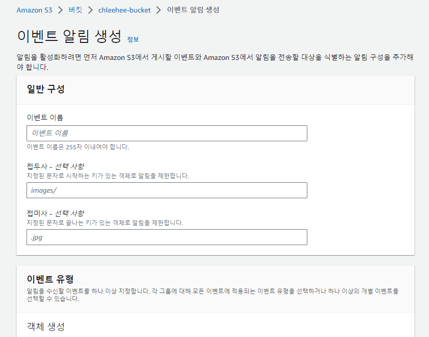

# Snowflake Snowpipe

- 참고 : https://docs.snowflake.com/en/user-guide/data-load-snowpipe-intro

### 1. Snowpipe Overview

- Snowpipe를 사용하면 파일이 snowpipe에 연결된 stage에 loading됨과 동시에 파일에서 데이터를 Target Table에 load할 수 있음.
- 참조된 pipe에 정의된 COPY문에 따라 데이터가 load됨. (ex: copy into JSON_TABLE ...)
- JSON 및 Avro와 같은 반정형 데이터를 포함한 모든 데이터 유형을 지원함.

```sql
-- stage 생성 --
 CREATE STAGE mystage
  URL = 's3://<bucket>/snowflake/' -- snowflake/ 는 사용자가 만든 경로 
  STORAGE_INTEGRATION = chlee_intergration;

-- pipe 생성 --
 -- auto_ingest : 새 데이터를 로드할 준비가 되었을 때 S3 버킷에서 SQS 대기열로 전송된 이벤트 알림을 읽도록 지정함.
  create pipe mypipe auto_ingest=true as
  copy into JSON_TABLE 				-- Target Table
  from @mystage
  file_format = json_file_format;
```

#### 1-1. Snowpipe 작동 방법

##### 1-1-1. Automating Snowpipe using cloud messaging

- 자동화된 데이터 load 방법으로 **클라우드 스토리지에 대한 이벤트 알림**을 활용하여 로드할 새 데이터 파일이 있으면 Snowpipe에 알림을 보냄.

##### 1-1-2. Calling Snowpipe REST Endpoints

- pipe의 이름과 데이터 파일 이름 목록을 사용하여 REST endpoint를 호출함. pipe 객체에서 참조하는 stage에서 데이터 파일 이름 목록과 일치하는 새 데이터 파일이 발견되면 pipe가 load를 수행.

##### 1-1-3. Supported Cloud Storage Services (1-1-1, 1-1-2 둘 다 가능)

- Snowflake 계정에 지원되는 클라우드 스토리지 서비스.


#### 1-2. Snowpipe 와 Bulk Data Loading 비교 및 차이점

- 참고 :
  - https://docs.snowflake.com/en/user-guide/data-load-snowpipe-intro
  - https://docs.snowflake.com/en/user-guide/data-load-overview

| 비교항목          | Snowpipe                                                     | Bulk Data load(Copy INTO)                                    |
| ----------------- | ------------------------------------------------------------ | ------------------------------------------------------------ |
| Load History      | pipe의 메타데이터에 14일 동안 저장.                          | 64일 동안 Target 테이블의 메타데이터에 저장됨.               |
| Transactions      | 데이터 Load는 각 데이터 파일의 행 수와 size에 따라 단일 또는 여러 트랜잭션으로 결합되거나 분할 됨. | 항상 단일 트랜잭션에서 수행됨. 데이터는 사용자가 수동으로 제출한 다른 SQL문과 함께 테이블에 삽입됨. |
| Compute Resources | Snowflake에서 제공하는 계산 리소스                           | COPY 문을 사용하기 위해 사용자 지정 warehouse 필요           |
| Cost              | 파일을 로드하는 동안 Snowpipe 웨어하우스에서 사용된 계산 리소스에 따라 청구됨. | 각 가상 웨어하우스가 활성화된 시간에 대해 청구됨.            |

#### 1-3. Pipe 사용 쿼리

- 자주 사용하는 파라미터만 표기함. 상세 파라미터 내용은 **참고 링크**로 이동.

##### 1-3-1. Create pipe

- 참고 :  https://docs.snowflake.com/en/sql-reference/sql/create-pipe
- copy into `<table>` 구문의 일부 기능이 제한 됨. 참고 링크의 "Usage Notes" 섹션 참고

  - select문에서 where문 사용 불가.

    - ```sql
      create pipe mypipe2 as copy into mytable(C1, C2) from (select $5, $4 from @mystage);
      ```
- ```sql
  -- 1-1-1. Automating Snowpipe using cloud messaging 방식 쿼리 예제
  create pipe mypipe_s3   -- pipe Name
    auto_ingest = true    -- aws 이벤트 알림을 받을때 사용하는 것으로 데이터 파일을 자동으로 로드할지 여부를 지정.
    aws_sns_topic = 'arn:aws:sns:us-west-2:001234567890:s3_mybucket'
    comment = 'pipe test' -- pipe comment
    as
    copy into snowpipe_db.public.mytable
    from @snowpipe_db.public.mystage
    file_format = (type = 'JSON');
  ```

##### 1-3-2. Alter pipe

- 참고 : https://docs.snowflake.com/en/sql-reference/sql/alter-pipe
- 허용 기능 :

  - Pipe 일시중지
  - Pipe Refreshing(ex: Target 테이블로 로드하기 위해 S3에 있는 파일을 Snowpipe의 SQS Queue에 넣음.)
    - SQS Queue : 3-2. Load Order of Data Files 참고.
  - Pipe comment를 Adding/Overwriting/Removing
  - Pipe에 tag Setting/unsetting (tag : 리소스나 객체를 구분하고 관리하는데 사용)
- ```sql
  -- pipe 일시 중지 예제 , 주로 pipe 소유권 변경이 될때 사용됨.
  alter pipe mypipe SET PIPE_EXECUTION_PAUSED = true;
  
  -- comment Add or modify 예제
  alter pipe mypipe SET COMMENT = "Pipe for North American sales data";
  
  -- Refreshing 쿼리 예제
  CREATE PIPE mypipe AS COPY INTO mytable FROM @mystage/path1/;
  
  -- REFRESH : snowpipe가 파일의 하위 집합을 로드하지 못할 때 특정 문제를 해결하기 위해 단기적으로 사용하기 위한것으로 정기적으로 사용하기 위한 것이 아님.
  ALTER PIPE mypipe REFRESH;
  
  -- 로드할 파일 목록 추가 제한 예제
  -- @mystage/path1/d1 에서 파일 로드함.
  ALTER PIPE mypipe REFRESH PREFIX='d1/';
  
  -- 지정된 타임 이후에 staged된 파일만 로드함.
  ALTER PIPE mypipe REFRESH PREFIX='d1/' MODIFIED_AFTER='2018-07-30T13:56:46-07:00';
  ```

##### 1-3-3. Drop pipe

- 지정된 스키마에서 지정된 Pipe를 제거함.
- ```sql
  DROP PIPE IF EXISTS mypipe;
  
  +------------------------------+
  | status                       |
  |------------------------------|
  | MYPIPE successfully dropped. |
  +------------------------------+
  ```

##### 1-3-4. Describe pipe

- 참고 : https://docs.snowflake.com/sql-reference/sql/desc-pipe
- Pipe에 대해 지정된 속성을 설명함.
- ```sql
  desc pipe mypipe;
  
  +-------------------------------+--------+---------------+-------------+---------------------------------+----------+---------+
  | created_on                    | name   | database_name | schema_name | definition                      | owner    | comment |
  |-------------------------------+--------+---------------+-------------+---------------------------------+----------+---------|
  | 2017-08-15 06:11:05.703 -0700 | MYPIPE | MYDATABASE    | PUBLIC      | copy into mytable from @mystage | SYSADMIN |         |
  +-------------------------------+--------+---------------+-------------+---------------------------------+----------+---------+
  ```
- Output : Pipe 속성 및 메타 데이터를 제공

  - | Column                   | Description                                                                                                                                                               |
    | :----------------------- | :------------------------------------------------------------------------------------------------------------------------------------------------------------------------ |
    | `created_on`           | Pipe 생성 날짜 및 시간                                                                                                                                                    |
    | `name`                 | Name of the pipe.                                                                                                                                                         |
    | `database_name`        | Pipe가 저장된 DB 명                                                                                                                                                       |
    | `schema_name`          | Pipe가 저장된 스키마 명                                                                                                                                                   |
    | `definition`           | Pipe 생성할때 사용한 COPY 문                                                                                                                                              |
    | `owner`                | Pipe에 대한 소유권 권한이 있는 역할                                                                                                                                       |
    | `notification_channel` | DEFINITION 열에 지정된 stage에 대한 Amazon SQS 대기열의 Amazon 리소스 이름.                                                                                               |
    | `comment`              | Comment for this pipe.                                                                                                                                                    |
    | `integration`          | Google Cloud Storage or Microsoft Azure cloud storage 에서 데이터 로드를 트리거 하기 위해 알림 이벤트에 의존하는 Pipe에 대한 알림 통합의 이름. AWS 사용 시 NULL로 표기됨. |
    | `pattern`              | Copy문에서의 PATTERN 옵션에 대한 값.                                                                                                                                      |
    | `error_integration`    | 알림을 트리거하기 위해 S3의 error events에 의존하는 Pipe에 대한 알림 통합 이름.                                                                                           |
    | `invalid_reason`       | Pipe에 문제가 있을 수 있는 일부 세부 정보를 표시함. 문제 없을 시 값은 NULL.                                                                                               |

##### 1-3-5. SHOW pipe

- 참고 : https://docs.snowflake.com/sql-reference/sql/show-pipes
- ```sql
  -- db에 있는 모든 파이프 조회 쿼리 예제
  use database mydb;
  
  show pipes;
  ```
- Output : desc pipe mypipe; 와 같음.

  - desc는 특정 pipe에 대한 정보를 출력하고, show pipes; 는 지정된 범위의 모든 pipe 정보를 조회할 수 있음.

##### 1-3-6. Pipe status 조회

```sql
-- pipe의 현재 상태를 알 수 있음.
SYSTEM$PIPE_STATUS( '<pipe_name>' )
```

### 2. Snowpipe Access Control Privileges

#### 2-1. Creating Pipes

- pipe를 만들고 관리하는데 필요한 최소 권한은 다음과 같다.
- | Object                       | Privilege          | Notes                 |
  | :--------------------------- | :----------------- | :-------------------- |
  | Database                     | USAGE              |                       |
  | Schema                       | USAGE, CREATE PIPE |                       |
  | Stage in the pipe definition | USAGE              | External stages only. |
  | Stage in the pipe definition | READ               | Internal stages only. |
  | Table in the pipe definition | SELECT, INSERT     |                       |

#### 2-2. Owning Pipes

- pipe가 생성된 후에는 pipe owner(pipe에 대한 소유권이 있는 역할)에게 다음과 같은 권한이 있어야 함.
- | Object                       | Privilege      | Notes                 |
  | :--------------------------- | :------------- | :-------------------- |
  | Database                     | USAGE          |                       |
  | Schema                       | USAGE          |                       |
  | Pipe                         | OWNERSHIP      |                       |
  | Stage in the pipe definition | USAGE          | External stages only. |
  | Stage in the pipe definition | READ           | Internal stages only. |
  | Table in the pipe definition | SELECT, INSERT |                       |

#### 2-3. Pausing or Resuming Pipes

- pipe owner 외에도 pipe 일시 중지 or 재개할 최소 권한은 다음과 같다.
- | Object                       | Privilege      | Notes                 |
  | :--------------------------- | :------------- | :-------------------- |
  | Database                     | USAGE          |                       |
  | Schema                       | USAGE          |                       |
  | Pipe                         | OPERATE        |                       |
  | Stage in the pipe definition | USAGE          | External stages only. |
  | Stage in the pipe definition | READ           | Internal stages only. |
  | Table in the pipe definition | SELECT, INSERT |                       |

### 3.  Snowpipe 참고내용 :

#### 3-1. Recommended Load File Size

- 각 파일 당 압축된 크기로 약 100 ~ 250MB로 생성 권장.
  - 매우 큰 파일(ex: 100GB) 로드하지 않는 것이 좋음.
  - Snowpipe는 일반적으로 파일 알림이 전송된 후 **1분 이내**에 새로운 데이터를 로드하도록 설계됬지만, 실제로 대용량 파일의 경우 or 데이터의 압축 해제, 암호 해독 및 변환에 큰 컴퓨팅 리소스가 필요한 경우 로드 시간이 오래 걸릴 수 있음.

#### 3-2. Load Order of Data Files

- 각각의 Snowpipe 객체는 load 대기 중인 데이터 파일의 순서를 지정하는 **단일 대기열(SQS Queue)**이 있음. Stage에서 새 데이터 파일이 발견되면 Snowpipe는 이를 대기열에 추가함. 그러나 여러 프로세스가 대기열에서 파일을 가져오면서 일반적으로 먼저 대기열에 들어온 파일을 처리하지만, Stage에 파일이 업로드 되는 순서와 동일하다는 보장은 없음.(즉, S3 같은 Object Storage에 업로드된 파일 순서와 일치하지 않을 수 있음.)
- 

#### 3-3. Data Duplication

- Snowpipe는 각각의 pipe 개체와 연결된 file loading metadata를 사용하여 Target Table에서 동일한 파일을 다시 로드하거나 데이터를 복제하지 못하도록 함.
  - metadata는 로드된 각 파일의 경로와 이름을 저장하고, 수정된 파일이라도 동일한 이름의 파일을 로드하지 못하도록 함.

#### 3-4. Snowpipe 부하에 끼치는 요인

- 파일 형식과 크기
- COPY문의 복잡성(SELECT 문 포함.)

### 4. Automating Snowpipe for Amazon S3

- 참고 :
  - https://docs.snowflake.com/en/user-guide/data-load-snowpipe-auto-s3
  - https://medium.com/plumbersofdatascience/how-to-ingest-data-from-s3-to-snowflake-with-snowpipe-7729f94d1797

#### 4-1. Snowpipe 사용을 위한 S3 Setting

- 사전 준비 : S3 bucket 생성.

##### 4-1-1. Step 1: Configure Access Permissions for the S3 Bucket

- Snowflake에서 S3의 폴더에 접근하려면 **IAM 정책**을 만들고 정책을 역할에 연결한 후, 역할에 AWS에서 생성한 **Security credentials**를 사용해야함. 정책에는 다음과 같은 권한이 필요함.

  - `s3:GetBucketLocation`
  - `s3:GetObject`
  - `s3:GetObjectVersion`
  - `s3:ListBucket`
- AWS 로그인 후 서비스에서  IAM(Identity & Access Management)을 선택.
- 왼쪽 탐색 창에서 "**Account settings**" 선택 후, "**Security Token Service Regions**" 에서 계정에 해당하는 AWS 지역을 찾은 후, 비활성화 인 경우 활성화 한다.
- 왼쪽의 "Policies"  를 클릭 후 "Create Policy" 선택하고 JSON 탭을 클릭하여 밑의 내용을 복사한다.
- "`<bucket>`" : (버킷 명) and "`<prefix>`" : (버킷내의 폴더명) 은 자신의 것으로 변경해야 함.

  - ```json
    {
        "Version": "2012-10-17",
        "Statement": [
            {
                "Effect": "Allow",
                "Action": [
                  "s3:GetObject",
                  "s3:GetObjectVersion"
                ],
                "Resource": "arn:aws:s3:::<bucket>/<prefix>/*"
            },
            {
                "Effect": "Allow",
                "Action": [
                    "s3:ListBucket",
                    "s3:GetBucketLocation"
                ],
                "Resource": "arn:aws:s3:::<bucket>",
                "Condition": {
                    "StringLike": {
                        "s3:prefix": [
                            "<prefix>/*"
                        ]
                    }
                }
            }
        ]
    }
    ```
- "Review policy" 클릭 후 정책 이름과 Description 작성 후, "Create policy" 클릭.

  - 

##### 4-1-2. Step 2: Create the IAM Role in AWS

- IAM Role을 생성 후 Step1에서의 IAM 정책과 연결한다. 후에 Snowflake의 storage Integration에 사용할 예정.
- 역할 섹션으로 이동 후, 새 IAM 역할을 만든다.

  - 
- AWS 계정 -> 다른 AWS 계정 -> 계정 ID에 자신의 AWS 계정 ID 입력 후 옵션에서 외부 ID 필요 활성화 후 외부ID "0000" 입력.

  - 
- 다음 클릭 후, Step1 에서 생성한 정책을 선택 후 다음을 클릭한다.
- 역할의 이름과 설명을 입력하고 역할을 만든다. 여기까지 IAM 정책을 만들고 IAM 역할 생성 후, 정책을 역할에 연동함.

  - 
- 자신이 생성한 IAM 역할의 요약 페이지에서 **ARN값**을 복사한다. 이것은 Snowflake의 Integration을 생성할 때 사용함.

  - 

##### 4-1-3. Step 3: Create a Cloud Storage Integraion in Snowflake

- S3와 Snowflake의 연결을 구성하기 위해, Snowflake로 이동 후 **STORAGE INTEGRATION**을 만들 것임.
- <iam_role> 부분에 Step2의 ARN 값을 넣는다.
- ```sql
  -- INTEGRATION을 create or replace 할 경우, 외부 ID는 AWS의 IAM -> role -> 생성한 role -> 신뢰 관계에서 계속 편집 필요. 
  CREATE STORAGE INTEGRATION chlee_intergration
    TYPE = EXTERNAL_STAGE
    STORAGE_PROVIDER = 'S3'
    ENABLED = TRUE
    STORAGE_AWS_ROLE_ARN = '<iam_role>' -- AWS에서 IAM -> role 에서 만든 역할의 ARN(AWS에서 조회 가능)
    STORAGE_ALLOWED_LOCATIONS = ('s3://<bucket>/<path>/', 's3://<bucket>/<path>/') -- stage에서 참조할 수 있는 버킷
    STORAGE_BLOCKED_LOCATIONS = ('s3://<bucket>/<path>/', 's3://<bucket>/<path>/'); -- stage에서 참조 할수 없는 버킷
  
  -- STORAGE_AWS_IAM_USER_ARN, STORAGE_AWS_EXTERNAL_ID 두 개의 정보를 AWS -> IAM -> role -> 생성한 role -> 신뢰 관계에서 편집 
  -- STORAGE_AWS_EXTERNAL_ID  : The external ID that is needed to establish a trust relationship.
    desc integration chlee_intergration; -- desc : describe
  ```

##### 4-1-4. Step 4: Retrieve the AWS IAM User for your Snowflake Account

- 아래의 명령어를 입력 후 "STORAGE_AWS_IAM_USE_ARN" , "STORAGE_AWS_EXTERNAL_ID" 두 값을 기록한다.
- "`<integraion Name>`" 은 자신이 만든 STORAGE INTEGRATION을 말함.
- ```sql
  desc integration "<integraion Name>";
  ```

##### 4-1-5. Step 5: Grant the IAM User Permissions to Access Bucket Objects

- 다시 AWS계정의 IAM 역할 세션으로 들어가서 자신이 만든 IAM 역할 요약 페이지를 클릭한 후, 신뢰 관계를 클릭하고 편집을 클릭한다.
- 기록한 두 값을 json 파일의 "<snowflake_user_arn>", "<snowflake_external_id>"  부분에 입력한다.

  - ```sql
    {
      "Version": "2012-10-17",
      "Statement": [
        {
          "Sid": "",
          "Effect": "Allow",
          "Principal": {
            "AWS": "<snowflake_user_arn>"
          },
          "Action": "sts:AssumeRole",
          "Condition": {
            "StringEquals": {
              "sts:ExternalId": "<snowflake_external_id>"
            }
          }
        }
      ]
    }
    ```
- 여기까지 S3와 Snowflake에 대한 설정이 완료되었다. 새로운 데이터가 S3에 들어오면 Pipe를 생성하고 자동으로 S3에서 Snowflake로 데이터를 가져올 준비가 되었다.

#### 4-2. Creating a New S3 Event Notification to Automate Snowpipe

- S3 버킷에 대한 **Amazon SQS(Simple Queue Service) 알림** 을 사용하여, Snowpipe를 자동화 하려함.

  - S3 이벤트 알림은 파일을 로드할 준비가 되었다는 것을 SQS Queue를 통해 Pipe에 알려주고, Pipe는 파일을 Queue에 복사함.
  - Snowflake 가상 웨어하우스는 지정된 파이프에 정의된 쿼리문을 기반으로 대기열에 있는 파일의 데이터를 Target Table로 로드함.
  - 
- 데이터가 있는 S3 버킷 경로에 대한 S3 이벤트 알림이 있는지 확인 필요.
- **참고사항** :

  - S3 버킷에 충돌하는 이벤트 알림이 있는 경우 "옵션2(참고->Determining the Correct Option)"로 수행, AWS는 동일한 대상 경로에 대해 충돌하는 알림을 생성하는 것을 금지함.
    - 참고 : https://docs.snowflake.com/en/user-guide/data-load-snowpipe-auto-s3#determining-the-correct-option
- **Step 1** : Create a Stage

  - CREATE STAGE 명령을 사용하여 S3 버킷을 참조하는 외부 Stage를 생성함.
  - ```sql
    -- stage 생성 --
     CREATE STAGE mystage
      URL = 's3://<bucket>/snowflake/' -- 사용자 버킷
      STORAGE_INTEGRATION = chlee_intergration; -- 4-1-3. Step 3에서 만든 Integration
    
    ```
- **Step 2** : Create a Pipe with Auto-Ingest Enabled

  - CREATE PIPE 명령을 사용하여 pipe를 생성.
  - ```sql
    -- pipe 생성 --
     -- auto_ingest : 새 데이터를 로드할 준비가 되었을 때 S3 버킷에서 SQS 대기열로 전송된 이벤트 알림을 읽도록 지정함.
      create pipe mypipe auto_ingest=true as
      copy into JSON_TABLE
      from @mystage
      file_format = json_file_format;
    ```
  - **주의사항** : 여러개의 pipe가 같은 stage(ex: mystage)를 바라보면, 여러 pipe가 같은 파일을 로드함.
- **Step 3** : Configure Security (Snowpipe 테스트 시 Step 3은 넘어가도 됨.)

  - Snowpipe를 사용하여 지속적인 데이터 로드를 실행할 각 사용자에게 객체에 대한 권한을 부여해야 함.
  - 필요한 최소 권한 :

    - | Object            | Privilege       | Notes                                    |
      | :---------------- | :-------------- | :--------------------------------------- |
      | Named pipe        | OWNERSHIP       |                                          |
      | Named stage       | USAGE , READ    |                                          |
      | Named file format | USAGE           | 옵션으로 file format을 사용할 경우 필요. |
      | Target database   | USAGE           |                                          |
      | Target schema     | USAGE           |                                          |
      | Target table      | INSERT , SELECT |                                          |
  - 권한 부여 : 권한을 부여하고 관리할 수 있는 securityadmin 역할 이상으로 role 생성.

    - ```sql
      -- Create a role to contain the Snowpipe privileges
      use role securityadmin;
      
      create or replace role snowpipe1;
      
      -- Grant the required privileges on the database objects
      grant usage on database snowpipe_db to role snowpipe1;
      
      grant usage on schema snowpipe_db.public to role snowpipe1;
      
      grant insert, select on snowpipe_db.public.mytable to role snowpipe1;
      
      grant usage on stage snowpipe_db.public.mystage to role snowpipe1;
      
      -- Grant the OWNERSHIP privilege on the pipe object
      grant ownership on pipe snowpipe_db.public.mypipe to role snowpipe1;
      
      -- Grant the role to a user
      grant role snowpipe1 to user jsmith;
      
      -- Set the role as the default role for the user
      alter user jsmith set default_role = snowpipe1;
      ```
- **Step4** : Configure Event Notifications

  - 아래 명령어를 실행하고 "Notification_channel"의 값(Stage에 대한 SQS Queue의 ARN)을 기록한다.
  - ```sql
    SHOW PIPES;
    ```
  - AWS S3 버킷에서 속성 탭으로 이동하여 밑으로 이동하면 "이벤트알림" 섹션에서 이벤트알림을 생성한다.

    - 
  - 이벤트 알림 섹션에서

    - "일반 구성" - 이벤트 이름 작성
    - "이벤트 유형" - "모든 객체 생성 이벤트(s3:ObjectCreated)" 선택
    - 맨밑의 "대상" - "SQS 대기열" 선택 -> "SQS 대기열 ARN 입력" 선택 후,  "Notification_channel"의 값을 붙여넣는다.
    - 
- 여기까지 자동화된 pipe의 설정이 끝났다. S3에 데이터를 넣고 동작을 확인한다.

  - 참고 사항
    - AWS는 알림 대기열 구성 수를 S3 버킷당 최대 100개로 제한한다.
    - AWS는 동일한 S3 버킷에 대해 중복된 대기열 구성(이벤트 알림)을 허용하지 않는다.
      - ex) 기존알림이 "s3://mybucket/load/path1"  구성된 경우, s3://mybucket/load와 같은 상위 수준에서 다른 알림을 생성할 수 없거나 그 반대의 경우도 생성할 수 없다.

#### 4-3. 전체 쿼리

- S3 버킷에 대한 **Amazon SQS(Simple Queue Service) 알림**을 사용하여 Snowpipe 데이터 로드를 자동으로 트리거하는 예.

  - STORAGE_ALLOWED_LOCATIONS : 필수 파라미터 , STORAGE_BLOCKED_LOCATIONS : 옵션 파라미터
    - 생성한 INTEGRATION을 참조하는 stage가 생성되거나 수정될 때 이 버킷에 대한 액세스를 각각 제한 하거나 차단.
    - `<path> : 버킷의 객체를 세부적으로 제어하는데 사용할 수 있는 선택적 경로.`

```sql
-- S3에 JSON 데이터 올리고 Snowpipe를 통해, JSON 데이터 로드 쿼리 --

USE ROLE ACCOUNTADMIN; -- 지정된 ROLE 사용권장, 편의상 ACCOUNTADMIN 사용.
USE WAREHOUSE PENTA_WH;
USE DATABASE PENTA_DB;
USE SCHEMA PARIS_POC_CH;

-- create table -- pipe 기능 테스트
CREATE OR REPLACE TABLE JSON_TABLE (
JSON_VARIANT VARIANT);

-- create json file format -- 
create or replace file format json_file_format
TYPE='JSON'
STRIP_OUTER_ARRAY = TRUE -- 외부 bracket 삭제 , Loading 할때만 사용.
;

-- INTEGRATION을 create or replace 할 경우, 외부 ID는 AWS의 IAM -> role -> 생성한 role -> 신뢰 관계에서 계속 편집 필요. 
CREATE STORAGE INTEGRATION chlee_intergration
  TYPE = EXTERNAL_STAGE
  STORAGE_PROVIDER = 'S3'
  ENABLED = TRUE
  STORAGE_AWS_ROLE_ARN = '<iam_role>' -- AWS에서 IAM -> role 에서 만든 역할의 ARN(AWS에서 조회 가능)
  STORAGE_ALLOWED_LOCATIONS = ('s3://<bucket>/<path>/', 's3://<bucket>/<path>/') -- stage에서 참조할 수 있는 버킷
  STORAGE_BLOCKED_LOCATIONS = ('s3://<bucket>/<path>/', 's3://<bucket>/<path>/'); -- stage에서 참조 할수 없는 버킷

-- STORAGE_AWS_IAM_USER_ARN, STORAGE_AWS_EXTERNAL_ID 두 개의 정보를 AWS -> IAM -> role -> 생성한 role -> 신뢰 관계에서 편집 
-- STORAGE_AWS_EXTERNAL_ID  : The external ID that is needed to establish a trust relationship.
  desc integration chlee_intergration; -- desc : describe

-- stage 생성 --
 CREATE STAGE mystage
  URL = 's3://<bucket>/snowflake/'
  STORAGE_INTEGRATION = chlee_intergration;

-- pipe 생성 --
 -- auto_ingest : 새 데이터를 로드할 준비가 되었을 때 S3 버킷에서 SQS 대기열로 전송된 이벤트 알림을 읽도록 지정함.
  create pipe mypipe auto_ingest=true as
  copy into JSON_TABLE
  from @mystage
  file_format = json_file_format;

-- notification_channel 을 복사 후 AWS 버킷의 이벤트 알림 생성할때 입력 해줘야 함.
-- 이벤트 알림 생성 : 참고에서 Option 1: Creating a New S3 Event Notification to Automate Snowpipe
  show pipes;

-- S3 버킷에 파일을 업로드 한 후 데이터 로드 확인
  list @mystage;

  select * from JSON_TABLE;
```
