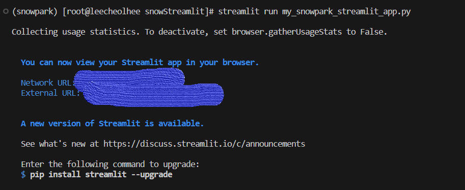
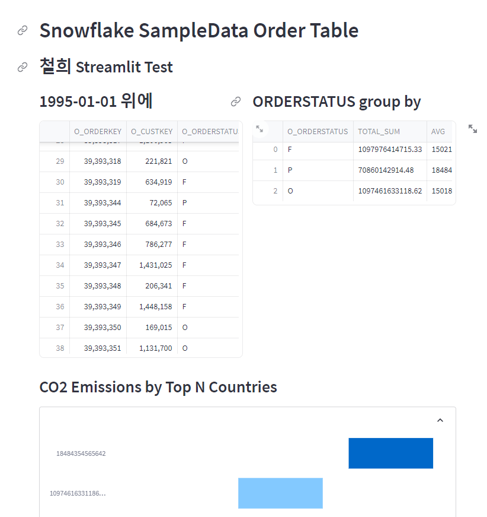

# StreamLit in Snowflake(SiS)

### 1. Snowflake SteamLit

- Streamlit : Python기반의 대화형 데이터 기반 웹 응용 프로그램을 만들 수 있는 Python 라이브러리.
- 참고 :

  - SnowSight에서 DB -> Schema 하위에 생성할 수 있음. (서울 region은 현재 안됨. 미국 region 가능)
  - Streamlit을 실행할 warehouse 필요.
  - DDL로 create, alter, drop 함.
  - Stage에 저장된 코드에서 Streamlit 생성 가능.
  - RBAC를 통해 접근 제어 (역할 기반)
  - 개발자가 편집하는 동안 App 실행하면 변경 내용이 App Viewer에 즉시 실시간으로 표시됨.
  - AWS PrivateLink를 사용하여 Snowflake 앱에서 Streamlit에 액세스하는 것은 지원되지 않음.

#### 1-1. 제한사항

- 일부 SQL command 금지(and their Snowpark Python analogs)
  - USE : Warehouse, Role, Database, Schema
  - PUT and GET
  - Some SHOW limitations(see the doc)

#### 1-2. 가격

- App이 editing or viewing mode 일때 계산 비용 발생.
- 15분 동안 비활성화이면 Sleep 됨.
- App Code 저장 시 Storage 비용 발생.
- Streamlit 비용은 Snowflake의 전체 compute and storage billing에 포함됨.
- 비용 추적을 원활하게 하기 위해 전용 Warehouse 사용 권장.

#### 1-3. 실습

- 참고 : https://quickstarts.snowflake.com/guide/getting_started_with_snowpark_for_python_streamlit/index.html#4
- 실습 환경 : VS Code , 회사 서버
- 실행 명령어 : "streamlit run [python 파일명].py"

```python
# Import required libraries
from snowflake.snowpark.session import Session
from snowflake.snowpark.functions import avg, sum, col,lit
import streamlit as st
import pandas as pd

# Create Session object
def create_session_object() -> Session:
   connection_parameters = {
      "account": "",
      "user": "",
      "password": "",
      "role": "ACCOUNTADMIN",
      "warehouse": "PENTA_WH",
      "database": "SNOWFLAKE_SAMPLE_DATA",
      "schema": "TPCH_SF10"
   }
   if "snowpark_session" not in st.session_state:
      session = Session.builder.configs(connection_parameters).create()
      st.session_state['snowpark_session'] = session
   else:
      session = st.session_state['snowpark_session']
   print("session 생성")
   return session

# snowpark function 참고 : https://github.com/snowflakedb/snowpark-python/blob/main/src/snowflake/snowpark/functions.py
# streamlit의 DF는 디폴트 200MB 까지만 보여줌. 설정 옵션이 있는 듯 함.(추후 살펴보기)
def load_data(session:Session):
   _tableName = "ORDERS"
   # session.sql("query") 사용 가능
   snow_df_co1 = session.sql('select * from orders limit 1000')
   
   # agg() : group_by와 많이 사용하며, sum(), avg()를 사용한 것 처럼 여러 열을 집계,평균 등 할 수 있음.
   # alias() : 열 이름 지정 
   snow_df_co2 = session.table(_tableName).group_by('O_ORDERSTATUS').agg(sum('O_TOTALPRICE').alias('total_sum'),avg('O_TOTALPRICE').alias('avg'))

   # SnowPark DF -> Pandas DF
   pd_df_co1 = snow_df_co1.to_pandas()
   pd_df_co2 = snow_df_co2.to_pandas()

   # Add header and a subheader
   st.header("Snowflake SampleData Order Table")
   st.subheader("철희 Streamlit Test")

   # Use columns to display the three dataframes side-by-side along with their headers
   col1, col2 = st.columns(2)
   with st.container():
      with col1:
         st.subheader('1995-01-01 위에')
         st.dataframe(pd_df_co1)
      with col2:
         st.subheader('ORDERSTATUS group by')
         st.dataframe(pd_df_co2)
  
   # 차트 생성
   with st.container():
      st.subheader('CO2 Emissions by Top N Countries')
      with st.expander(""):
         #emissions_threshold = st.number_input(label='Emissions Threshold',min_value=5000, value=20000, step=5000)
         #pd_df_co2_top_n = snow_df_co2.filter(col('Total CO2 Emissions') > emissions_threshold).toPandas()

         # set_index() : df의 열 이름이 들어가야 함. 
         st.bar_chart(data=pd_df_co2.set_index('O_ORDERSTATUS'), width=850, height=500, use_container_width=True)
   
if __name__ == "__main__":
   session = create_session_object()
   load_data(session)
```



- 실행 시 URL 2개 제공, 회사 서버에서 
  - Network URL : 내부 네트워크에서 액세스 할 수 있는 로컬 IP 주소. 주로 개발자가 로컬 환경에서 Streamlit 애플리케이션을 실행할 때 사용. 이 주소는 외부 네트워크에서는 접근할 수 없음.
  - External URL: 외부 네트워크에서 액세스할 수 있는 공용 IP 주소. 주로 애플리케이션을 배포하고 외부 사용자들이 접속할 때 사용됨. 이 주소는 외부 네트워크에서 접근 가능.


