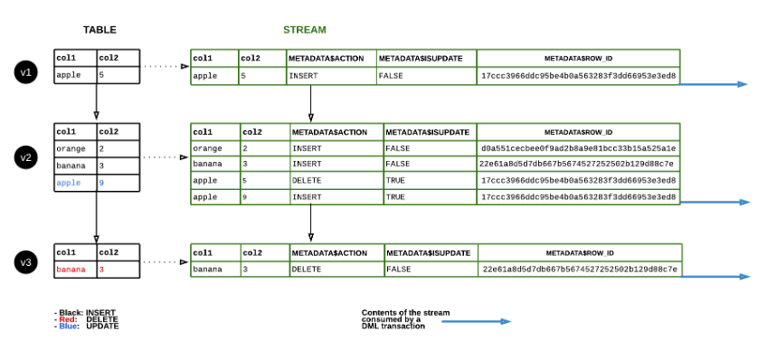

# Snowflake Stream and Task

### 1. Snowflake Task

- SQL command or a stored procedure의 실행을 스케줄하는데 사용되는 object.
- 복잡한 주기적인 일을 Task를 활용하여 실행함.
- Task는 table stream과 결합하여 최근에 변경된 테이블 행을 처리하는 연속 ELT 워크플로우를 수행할 수 있음.
- 새로 생성되거나 복제된 Task는 중단된 상태로 생성됨. 중단된 Task 재개는 "ALTER TASK ... RESUME"사용.

#### 1-1. Stored Procedure

- Stored procedures perform actions rather than return values.
- LANGUAGE : javascript, sql , python, java & scala.
- 저장 프로시저는 owner 의 권한 or caller의 권한으로 실행할 수 있음.
- 0 or more input parameters
- JavaScript API 사용 가능
- Return 옵션은 필수.

```sql
CREATE PROCEDURE EXAMPLE_STORED_PROCEDURE(PARAM1 STRING)
RETURNS STRING
LANGUAGE JAVASCRIPT
EXECUTE AS OWNER
AS
$$
var param1 = PARAM1;
var sql_command = “SELECT * FROM ” + param1; 
snowflake.execute({sqlText: sql_command});
return "Succeeded."; 
$$;
```

```sql
-- 호출 쿼리 예제
CALL EXAMPLE_STORED_PROCEDURE(‘EMP01’);

```

#### 1-2. Task Workflow

- ACCOUTNADMIN role or CREATE TASK privilege.

```sql
CREATE [ OR REPLACE ] TASK [ IF NOT EXISTS ] <name>
  [ { WAREHOUSE = <string> } | { USER_TASK_MANAGED_INITIAL_WAREHOUSE_SIZE = <string> } ]
  [ SCHEDULE = '{ <num> MINUTE | USING CRON <expr> <time_zone> }' ]
  [ CONFIG = <configuration_string> ]
  [ ALLOW_OVERLAPPING_EXECUTION = TRUE | FALSE ]
  [ <session_parameter> = <value> [ , <session_parameter> = <value> ... ] ]
  [ USER_TASK_TIMEOUT_MS = <num> ]
  [ SUSPEND_TASK_AFTER_NUM_FAILURES = <num> ]
  [ ERROR_INTEGRATION = <integration_name> ]
  [ COPY GRANTS ]
  [ COMMENT = '<string_literal>' ]
  [ AFTER <string> [ , <string> , ... ] ]
[ WHEN <boolean_expr> ]
AS
  <sql>
```

```sql
CREATE TASK T1 		-- Task Name
WAREHOUSE = MYWH	-- Warehouse Definition
SCHEDULE = '30 MINUTE'  -- Triggering Mechanism
WHEN system$stream_has_data('rawstream1') -- 스트림에서 변경 데이터가 존재하는지 여부확인하고 결과가 FALSE이면 현재 실행을 건너뜀.
AS
COPY INTO MY_TABLE	-- Query Definition
FROM $MY_STAGE;

```

```sql
ALTER TASK MINUTE_TASK RESUME; -- Start task
```

#### 1-3.  Task Example

```sql
USE ROLE ACCOUNTADMIN;
USE WAREHOUSE PENTA_WH;
USE DATABASE PENTA_DB;
USE SCHEMA PARIS_POC_CH;

create or replace table raw (var variant);
create or replace stream rawstream1 on table raw;
create or replace stream rawstream2 on table raw;
create or replace table names (id int, first_name string, last_name string);
create or replace table visits (id int, dt date);

create or replace task raw_to_names
warehouse = PENTA_WH
schedule = '1 minute'
when
system$stream_has_data('rawstream1')
as
merge into names n
  using (select var:id id, var:fname fname, var:lname lname from rawstream1) r1 on n.id = to_number(r1.id)
  when matched then update set n.first_name = r1.fname, n.last_name = r1.lname
  when not matched then insert (id, first_name, last_name) values (r1.id, r1.fname, r1.lname)
;

create or replace task raw_to_visits
warehouse = PENTA_WH
schedule = '1 minute'
when
system$stream_has_data('rawstream2')
as
merge into visits v
  using (select var:id id, var:visit_dt visit_dt from rawstream2) r2 on v.id = to_number(r2.id)
  when matched then update set v.dt = r2.visit_dt
  when not matched then insert (id, dt) values (r2.id, r2.visit_dt)
;

alter task raw_to_names resume;
alter task raw_to_visits resume;

insert into raw
  select parse_json(column1) -- column1 : values 절에서 임시로 생성한 테이블 컬럼명
  from values
  ('{"id": "123","fname": "Jane","lname": "Smith","visit_dt": "2019-09-17"}'),
  ('{"id": "456","fname": "Peter","lname": "Williams","visit_dt": "2019-09-17"}');

select * from rawstream1;
select * from rawstream2;

call system$wait(70);

select * from names;
select * from visits;

alter task raw_to_names suspend;
alter task raw_to_visits suspend;
```

### 2. Streams

- Insert, Delete, Update에 대해 DML 변경사항을 보고 추적하기 위해 생성되는 개체.
- CDC(Change Data Capture) 정보를 기록함.
- 사용자가 View의 변경 데이터를 조회하기 위해서는 View의 기본 테이블의 소유자만 tracking할 수 있음.
- Stream을 사용하기 위해서는 테이블과 View 에 대해 권한과 Change Tracking을 활성화 해야 함.
- 기본적으로 DML이 Auto commit되어 Stream을 조회하면 변경사항을 확인할 수 있지만 (BEGIN .. COMMIT)같은 걸로 commit 되기전의 변경사항은 확인 불가
- 다수의 사용자가 stream을 사용할때는 사용자 각각 stream 생성해주는게 좋음.(Multiple Consumers of Streams 섹션)

```sql
-- Create Stream
CREATE STREAM MY_STREAM ON TABLE MY_TABLE;

-- Query Stream
SELECT * FROM MY_STREAM;
```

#### 2-1. Stream Columns

- 참고 : https://docs.snowflake.com/en/user-guide/streams-intro
- 실제 테이블 열 or 데이터가 아닌 원본 개체에 대한 오프셋을 저장함.

  - METADATA$ACTION : 기록된 DML 작업을 나타냄. (INSERT, DELETE)
  - METADATA$ISUPDATE : 작업이 UPDATE 문의 일부였는지 여부를 나타냄.
  - METADATA$ROW_ID : 특정 행에 대한 시간 경과에 따른 변경 사항을 추적하는데 사용할 수 있는 행의 고유ID

#### 2-2. Stream Type

- 메타데이터를 기준으로 여러 Stream 유형이 있음.

##### 2-2-1. Standard(delta)

- table, directory table, view에 지원.  삽입,업데이트,삭제(테이블 잘라내기)를 포함하여 원본 개체에 대한 모든 DML 변경사항을 추적함.
- 삭제된 행은 delta에서 제거됨.
- geospatial data에 대한 변경 데이터는 사용불가. 전용 스트림 사용해야 함.

##### 2-2-2. Append-only

- standard table, directory table, view에 지원. 행 삽입만 추적함. 업데이트 및 삭제 작업(테이블 잘라내기 포함)은 기록되지 않음. ex) 10개 행을 삽입하고 행 5개를 삭제하면 10개의 행이 기록됨.
- 행 삽입에만 의존하므로 추출,로드,변환(ELT) 및 유사한 시나리오에 대한 표준 스트림보다 성능 우수할 수 있음.

##### 2-2-3. Insert-only

- External table에만 지원. 행 삽입만 추적하며 삽입된 집합(no-ops)에서 행을 제거하는 삭제 작업은 기록하지 않음. ex) 외부 테이블에서 참조하는 클라우드 저장 위치에서 File1이 제거되고 File2가 추가되면 스트림은 File2의 행에 대한 레코드만 반환됨.
- 덮어쓰거나 추가된 파일은 기본적으로 새 파일로 처리됨.

#### 2-3. Data Flow



#### 2-1. Explicitly(명시적) Enable Change Tracking on View

- View를 Create 하거나 ALTER View 할때 "CHANGE_TRACKING"변수를 설정함.
- change_tracking은 View의 기본이 되는 테이블에서도 명시적으로 활성화 되어야 함.
- 뷰의 스트림은 local view, secure view에 지원. materialized view는 추적하지 않음.

```sql
-- 보안 View 생성할때 change_tracking 설정 예제
CREATE SECURE VIEW v CHANGE_TRACKING = TRUE AS SELECT col1, col2 FROM t;

--기존의 View에 change_tracking을 사용하도록 수정 예제
ALTER VIEW v2 SET CHANGE_TRACKING = TRUE;
```

#### 2-2. Explicitly Enable Change Tracking on the Underlying Tables

- 사용자가 View의 변경 데이터를 조회하려면 View 및 underlying Table에 change_tracking을 활성화 해야 함.
- 개체 소유자(권한이 있는 역할)만 change_tracking 사용 가능.

```sql
-- table 생성할 때 change_tracking 설정 예제
CREATE TABLE t (col1 STRING, col2 NUMBER) CHANGE_TRACKING = TRUE;

-- 기존 table에 설정 예제
ALTER TABLE t1 SET CHANGE_TRACKING = TRUE;
```

#### 2-3. Avoiding Stream Staleness

- 참고 : https://docs.snowflake.com/en/user-guide/streams-manage
- Stream이 오래되지 않도록 하려면 STALLE_AFTER 타임스탬프 이전에 변경 데이터를 정기적으로 사용해야 함.
- STALLE_AFTER 열 타임스탬프는 Stream이 현재 만료될 것으로 예측되는 시기를 나타냄.
- 자세한 내용은 위의 링크 : 아직 이해 못함.
