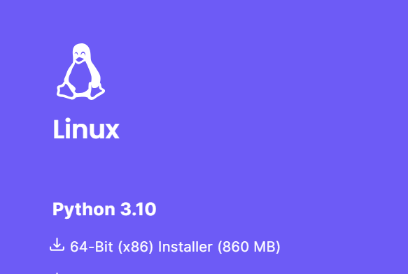
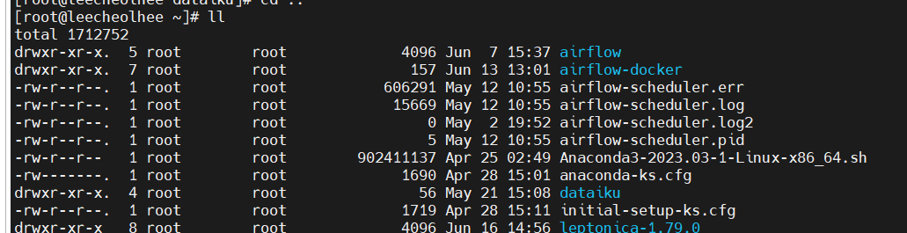
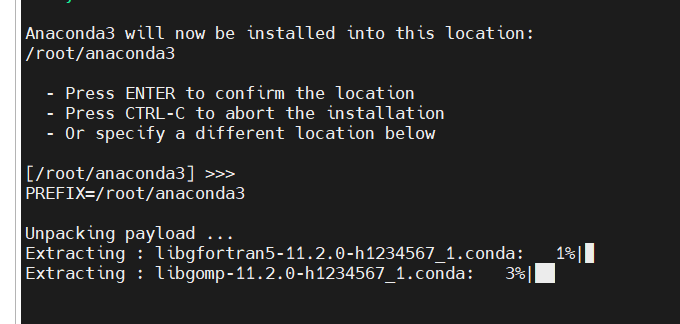
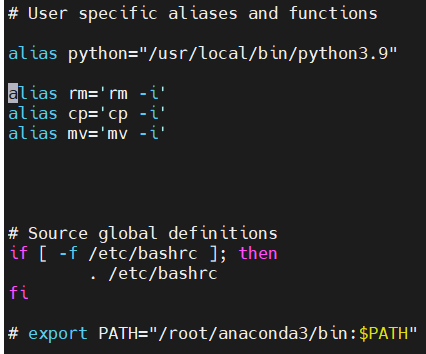
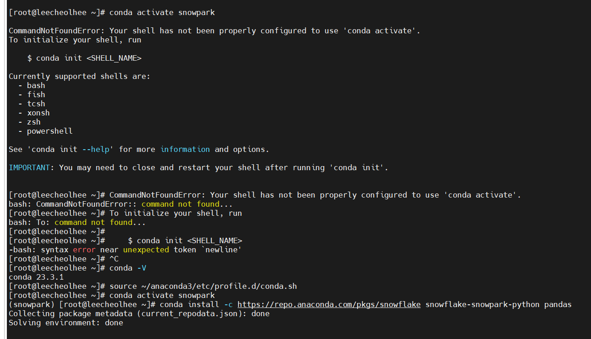

# Snowflake Streamlit Install Centos7

- 참고 : https://quickstarts.snowflake.com/guide/getting_started_with_snowpark_for_python_streamlit/index.html#1

### 1. Centos7 Conda Install

- https://www.anaconda.com/products/distribution 접속 후 밑의 그림 링크를 복사 한다.

- 설치할 곳에서 "wget 링크" 명령어 입력.

- "ll" 커맨드 실행 후 설치 파일 확인

  

- "bash Anaconda3-2023.03-1-Linux-x86_64.sh" 명령어 입력.
- 설치 후 설치 위치 확인.

- 환경 변수 설정

  - "vi ~/.bashrc" 입력 후 "i"를 눌러 insert 모드 진입.  맨 밑에 "export PATH=[anaconda3설치위치]/bin:$PATH" 입력
  - 

  - "conda -V" 실행 -> conda command not found 발생 시 "source ~/.bashrc" 후 다시 conda -V 실행.
    - 출력 : conda 버전 출력됨. 

- https://quickstarts.snowflake.com/guide/getting_started_with_snowpark_for_python_streamlit/index.html#1 이 링크 접속 후 "Setup Environment" 순서대로 실행.

  - conda create : 가상환경 생성
  - conda activate : 가상환경 활성화   => "conda activate snowpark" 에러 발생 시 "source ~/anaconda3/etc/profile.d/conda.sh" 실행 후 다시 활성화 하기
  - 

- 설치 완료

### 1-2. 추후 예정

- Docker를 활용하여 Python 가상환경 구축 
  - playwright 
  - snowflake
  - streamlit
