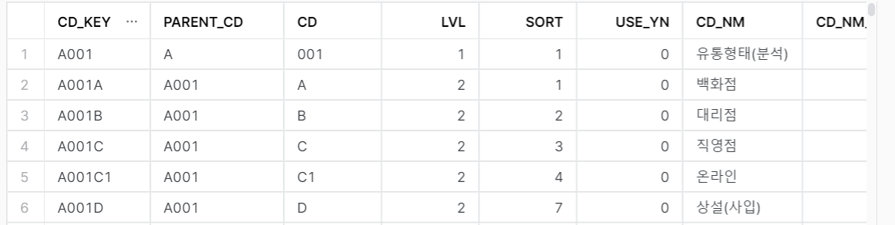
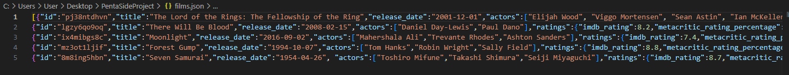
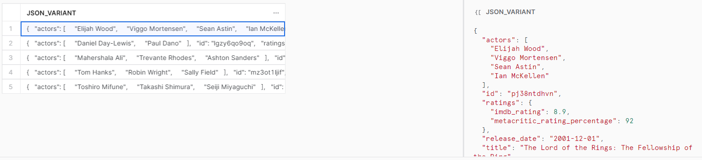
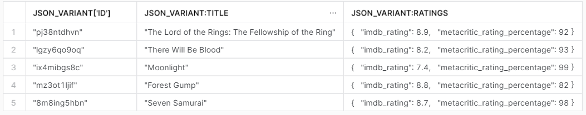
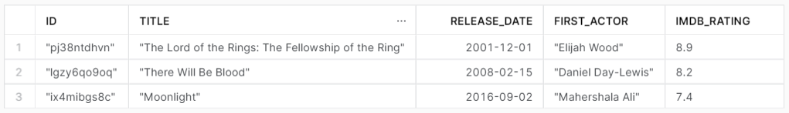
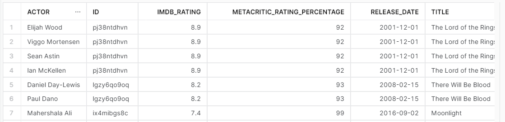
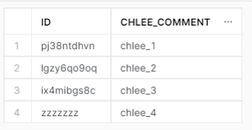
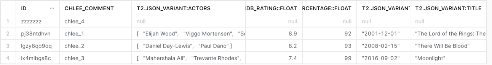

# Snowflake Local File 연동_반정형 데이터 활용

### 1. 정형, 반정형 데이터 Local To Snowflake

#### 1-1. CSV 파일 적재 (Local To Snowflake)

- DW , DB , SCHEMA, TABLE, STAGE 생성 및 ROLE 지정
- Local File 저장을 위한 csv Fileformat 생성

```sql
USE ROLE ACCOUNTADMIN;
USE WAREHOUSE PENTA_WH;
USE DATABASE PENTA_DB;
USE SCHEMA PARIS_POC_CH;

-- create table -- 
CREATE OR REPLACE TABLE dw_comn_cd (
  cd_key varchar(30) NOT NULL PRIMARY KEY,
  parent_cd varchar(8) NOT NULL,
  cd varchar(8) NOT NULL,
  lvl smallint NOT NULL,
  sort smallint NOT NULL,
  use_yn tinyint NOT NULL,
  cd_nm varchar(100) DEFAULT NULL,
  cd_nm_eng varchar(100) DEFAULT NULL,
  cd_nm_chn varchar(100) DEFAULT NULL,
  cd_nm_jpn varchar(100) DEFAULT NULL,
  cd_nm_etc varchar(100) DEFAULT NULL,
  rmk varchar(1000) DEFAULT NULL,
  erp_parent_cd varchar(24) DEFAULT NULL,
  erp_table varchar(24) DEFAULT NULL,
  val1 varchar(100) DEFAULT NULL,
  val2 varchar(100) DEFAULT NULL,
  val3 varchar(100) DEFAULT NULL,
  val4 varchar(100) DEFAULT NULL,
  val5 varchar(100) DEFAULT NULL,
  val6 varchar(100) DEFAULT NULL,
  val7 varchar(100) DEFAULT NULL,
  val8 varchar(100) DEFAULT NULL,
  val9 varchar(100) DEFAULT NULL,
  val10 varchar(100) DEFAULT NULL
);

-- Create csv file format to files in stage
CREATE OR REPLACE FILE FORMAT CSV_FORMAT
    TYPE                         = 'CSV', -- 파일 형식
    FIELD_DELIMITER              = ',',	  -- csv 컬럼 구분자
    RECORD_DELIMITER             = '\n',  -- csv 행 간의 구분자
    SKIP_HEADER                  = 1,     -- csv 파일 첫번째 행 건너 뛸지 여부 , 1: 헤더로 간주(건너뜀)
    FIELD_OPTIONALLY_ENCLOSED_BY = '"';   -- ex) "Alex ""Super"" Johnson" => Alex "Super" Johnson 로 인식 


-- Create Stage --
CREATE OR REPLACE STAGE CSV_STAGE
    FILE_FORMAT = CSV_FORMAT;
    
-- CMD에서 snowsql 접속 후 PUT 명령어 시행.
-- PUT file://C:\Users\User\Desktop\PentaSideProject\dw_comn_cd_paris_test.csv @CSV_STAGE auto_compress=false;

-- stage To table -- 
COPY INTO dw_comn_cd FROM @CSV_STAGE; 
```



#### 1-2. 반정형 데이터 적재 및 조회 (Local To Snowflake) - JSON 

- DW , DB , SCHEMA, TABLE, STAGE 생성 및 ROLE 지정
- Local File 저장을 위한 json Fileformat 생성



```sql
-- create json data Table --
CREATE OR REPLACE TABLE JSON_TABLE (
JSON_VARIANT VARIANT);

-- create json file format -- 
create or replace file format json_file_format
TYPE='JSON'
STRIP_OUTER_ARRAY = TRUE -- 외부 bracket 삭제 , Loading 할때만 사용.
;

-- create stage -- 
CREATE OR REPLACE STAGE JSON_STAGE
    FILE_FORMAT = json_file_format;

-- CMD 에서 snowsql 접속 후 PUT 명령어 실행
-- PUT file://C:\Users\User\Desktop\PentaSideProject\films.json @JSON_STAGE auto_compress=false;

-- stage to table -- 
COPY INTO JSON_TABLE
FROM @JSON_STAGE/films.json
FILE_FORMAT = json_file_format;

select * from json_table;
```



### 2. 반정형 데이터 활용 - JSON

#### 2-1. 반정형 데이터 접근

```sql
-- "[]" , ":" 으로 데이터 접근 가능 --
select json_variant['id'],json_variant:title, json_variant:ratings from json_table;
```



#### 2-2. 반정형 데이터 형변환 후 접근

- "::" 으로 명시적 형변환 가능.

```sql
SELECT 
json_variant['id'] as id, 
json_variant['title'] as title, 
json_variant['release_date']::date AS release_date, 
json_variant['actors'][0] as first_actor,
json_variant['ratings']['imdb_rating'] AS IMDB_rating
FROM json_table
WHERE release_date >= date('2000-01-01');
```



#### 2-3. FLATTEN 함수를 활용한 반정형 -> 정형 데이터 변환

- Lateral : join 기능 중 하나.

```sql
SELECT ...
FROM <left_hand_table_expression>, LATERAL ( <inline_view> )
...

-- left_hand_table_expression : table, view, subquery, table function, The result of an earlier join.
-- inline_view : FLATTEN, UDTF 와 같은 sql문 내에 정의된 뷰, 테이블이 될 수 없음.
```


```sql
select
    act.value::string as actor,  -- value : flatten()에서 나온 value
    json_variant:id::string as id,
    json_variant:ratings:imdb_rating::float as IMDB_rating,
    json_variant:ratings.metacritic_rating_percentage::float as metacritic_rating_percentage,
    json_variant:release_date::date as release_date,
    json_variant:title::string as title
    from 
    json_table
    ,lateral flatten(input=>json_variant:actors) act;
```



#### 2-4. 반정형, 정형 Table Join

- 목표 : 반정형 데이터와 정형 데이터를 바로 Join을 하여 활용함.

- Table Name : json_table


- Table Name : chlee_joinTable



- chlee_joinTable 과 json_table을 left outer join을 수행

```sql
select 
    t1.id, 
    t1.chlee_comment,
    t2.json_variant:actors,
    t2.json_variant:ratings:imdb_rating::float,
    t2.json_variant:ratings.metacritic_rating_percentage::float,
    t2.json_variant:release_date,
    t2.json_variant:title
from chlee_jointable as t1 
left outer join json_table as t2 
    on t1.id = t2.json_variant:id;
```


