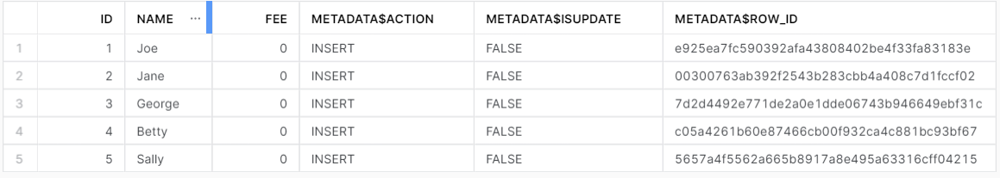
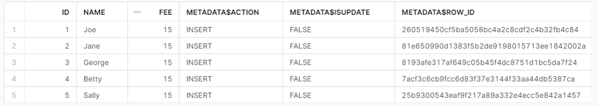
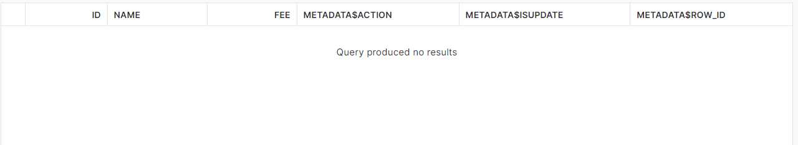
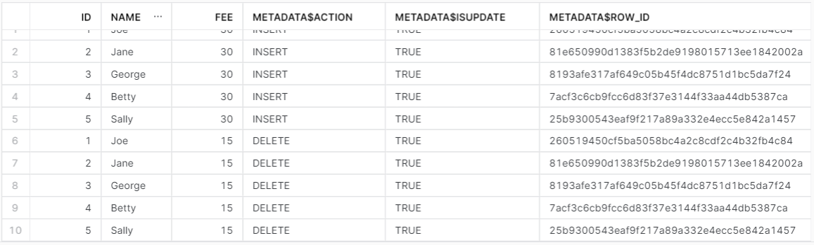
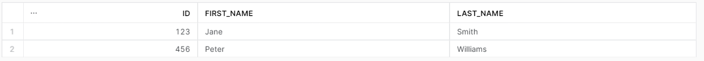
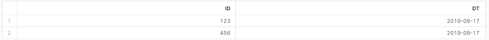
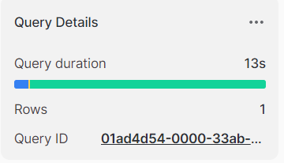
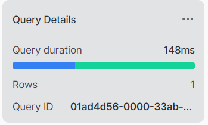
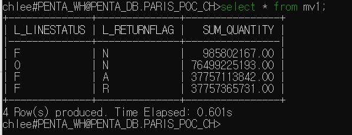
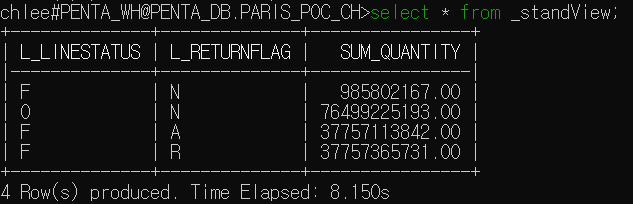

# Snowflake POC Stream , Task, MV (Materialized View)

### 1. Stream , Task

#### 1-1. Stream

- Insert, Delete, Update에 대해 DML 변경사항을 보고 추적하기 위해 생성되는 개체.
- Stream을 사용하기 위해서는 테이블과 View 에 대해 권한과 Change Tracking을 활성화 해야 함.
- 기본적으로 DML이 Auto commit되어 Stream을 조회하면 변경사항을 확인할 수 있지만 (BEGIN .. COMMIT)같은 걸로 commit 되기전의 변경사항은 확인 불가
- 다수의 사용자가 stream을 사용할때는 사용자 각각 stream 생성해주는게 좋음.(Multiple Consumers of Streams 섹션)

##### 1-1-1. Stream Columns

- METADATA$ACTION : 기록된 DML 작업을 나타냄. (INSERT, DELETE)
- METADATA$ISUPDATE : 작업이 UPDATE 문의 일부였는지 여부를 나타냄.
- METADATA$ROW_ID : 특정 행에 대한 시간 경과에 따른 변경 사항을 추적하는데 사용할 수 있는 행의 고유ID

```sql
USE ROLE ACCOUNTADMIN;
USE WAREHOUSE PENTA_WH;
USE DATABASE PENTA_DB;
USE SCHEMA PARIS_POC_CH;

CREATE OR REPLACE TABLE members (
  id number(8) NOT NULL,
  name varchar(255) default NULL,
  fee number(3) NULL
);

CREATE OR REPLACE STREAM member_check ON TABLE members;

INSERT INTO members (id,name,fee)
VALUES
(1,'Joe',0),
(2,'Jane',0),
(3,'George',0),
(4,'Betty',0),
(5,'Sally',0);

SELECT * FROM member_check;
```



- 이 상태에서"update members set NAME = 'chlee' where id = 1; " 업데이트 시 NAME의 데이터만 "chlee"로 업데이트 됨.


```sql
BEGIN; -- stream Lock --
UPDATE members SET fee = fee + 15 where fee = 0;
SELECT * FROM member_check;
COMMIT; -- stream Lock 해제 및 업데이트 --
```

- 트랜잭션 단위로 사용 시 COMMIT이 되어야 Stream이 업데이트 됨.




```sql
CREATE OR REPLACE TABLE members_prod (
  id number(8) NOT NULL,
  name varchar(255) default NULL,
  fee number(3) NULL
);

INSERT INTO members_prod(id,name,fee) SELECT id, name, fee FROM member_check WHERE METADATA$ACTION = 'INSERT';

SELECT * FROM member_check;
```

- stream의 데이터를 다른 Table로 넣거나, 원본 Table에서 데이터 삭제 시 Stream에서 해당 데이터 삭제 됨.




```sql
UPDATE members SET fee = fee + 15 where fee > 0;
SELECT * FROM member_check;
```

- 원본 데이터의 전체 데이터를 업데이트 시, 데이터 추적 기록 남음.
- 

#### 1-2. Task 

- SQL command or a stored procedure의 실행을 스케줄하는데 사용되는 object.
- 복잡한 주기적인 일을 Task를 활용하여 실행함.
- Task는 table stream과 결합하여 최근에 변경된 테이블 행을 처리하는 연속 ELT 워크플로우를 수행할 수 있음.
- 새로 생성되거나 복제된 Task는 중단된 상태로 생성됨. 중단된 Task 재개는 "ALTER TASK ... RESUME"사용.
- ACCOUTNADMIN role or CREATE TASK privilege 필요.

```sql 
-- raw 테이블에 데이터가 삽입 시 stream과 Task를 이용해 name, visits 테이블을 자동으로 업데이트 한다. --
USE ROLE ACCOUNTADMIN;
USE WAREHOUSE PENTA_WH;
USE DATABASE PENTA_DB;
USE SCHEMA PARIS_POC_CH;

-- 사용할 Table과 Stream을 생성 --
-- rawstream1은 name Table의 데이터를 업데이트할 시 사용 --
-- rawstream2은 visits Table의 데이터를 업데이트할 시 사용 --
create or replace table raw (var variant);
create or replace stream rawstream1 on table raw; -- name Table -- 
create or replace stream rawstream2 on table raw; -- visits Table --
create or replace table names (id int, first_name string, last_name string);
create or replace table visits (id int, dt date);

-- raw Table의 데이터를 name Table에 업데이트 하기 위한 raw_to_names Task 생성 --
-- merge into : 두 테이블을 on절의 조건으로 비교하여 Target Table(names)을 update or insert하는 쿼리 --
create or replace task raw_to_names
warehouse = PENTA_WH
schedule = '1 minute'
when
system$stream_has_data('rawstream1') -- stream에서 변경 데이터가 존재하는지 여부 확인
as
merge into names n
  using (select var:id id, var:fname fname, var:lname lname from rawstream1) r1 on n.id = to_number(r1.id)
  when matched then update set n.first_name = r1.fname, n.last_name = r1.lname
  when not matched then insert (id, first_name, last_name) values (r1.id, r1.fname, r1.lname)
;

-- raw Table의 데이터를 visits Table에 업데이트 하기 위한 raw_to_visits Task 생성 --
create or replace task raw_to_visits
warehouse = PENTA_WH
schedule = '1 minute'
when
system$stream_has_data('rawstream2') -- stream에서 변경 데이터가 존재하는지 여부 확인
as
merge into visits v
  using (select var:id id, var:visit_dt visit_dt from rawstream2) r2 on v.id = to_number(r2.id)
  when matched then update set v.dt = r2.visit_dt
  when not matched then insert (id, dt) values (r2.id, r2.visit_dt)
;

-- task 가동 -- 
alter task raw_to_names resume;
alter task raw_to_visits resume;

-- task 동작 확인을 위한 raw Table에 Data insert -- 
insert into raw
  select parse_json(column1) -- column1 : values 절에서 임시로 생성한 테이블 컬럼명
  from values
  ('{"id": "123","fname": "Jane","lname": "Smith","visit_dt": "2019-09-17"}'),
  ('{"id": "456","fname": "Peter","lname": "Williams","visit_dt": "2019-09-17"}');

select * from rawstream1;
select * from rawstream2;

-- 버퍼 대비 --
call system$wait(70);

select * from names;
select * from visits;

alter task raw_to_names suspend;
alter task raw_to_visits suspend;
```

- names Table Data 적재 확인



- visits Table Data 적재 확인




### 2. MV (Materialized View)

- Enterprise Edition 필요.
- 일반적인 Standard View가 Table에서 직접 쿼리하여 결과를 반환하지만, MV는 백그라운드에서 사전계산하여 일반적인 View보다 속도가 빠름. 
- 쿼리가 자주 실행되거나 대용량 데이터 세트에서 실행할때 유용함. (ex : 집계, 현재날짜 - 1일의 데이터만 조회 할 경우.)
- 지속적으로 업데이트 되는 테이블 보단 매일 배치로 업데이트 되는 테이블에서 유용(비용 관련)

#### 2-1. Standard View VS MV

- 약 60억의 행 개수의 데이터로 성능을 비교 한다.
- 데이터는 Snowflake의 Sample 데이터를 사용한다. "SNOWFLAKE_SAMPLE_DATA.TPCH_SF1000.LINEITEM" TABLE 사용.

##### 2-1-1. Create [ Standard View VS MV]

```sql
-- mv 생성 시간 --
create or replace materialized view mv1 as 
select 
L_LINESTATUS,
L_RETURNFLAG,
SUM(L_QUANTITY) as SUM_QUANTITY
from MV_TEST
group by L_LINESTATUS,
        L_RETURNFLAG;
```



```sql
-- 일반 view 생성 시간 -- 
create or replace view view_1 as 
select 
CR_RETURNED_DATE_SK,
CR_RETURNED_TIME_SK,
CR_ITEM_SK,
CR_REFUNDED_CUSTOMER_SK
from mvdata;
```




##### 2-1-2. Select [ Standard View VS MV]

```sql
-- mv1 성능 조회 시간 -- 
ALTER MATERIALIZED VIEW MV1 RESUME;
select * from mv1;
```



```sql
select * from _standView;
```



- View의 Base Table에 새로운 데이터가 삽입 될 시 MV는 백그라운드에서 사전 계산되어 재 조회 시 속도 차이가 없지만, 일반 Standard View는 Table에 다시 조회를 시행하므로 MV와 속도차이가 있음.
